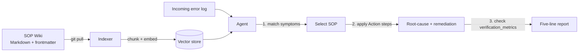

How an AIOps agent turns this wiki into **actionable knowledge**.

## Pipeline overview

## 1. Indexing

The agent treats the repo as its source of truth:

1. `git pull` the latest `main` (every change is an auditable commit).
2. Parse each file's frontmatter + body.
3. Chunk the body, embed, and store — keyed by `sop_id`.

Because the input is raw Markdown, **no API or scraping is required** — the
static site is only the human view.

## 2. Matching an incident

When an error log arrives, the agent:

- Retrieves candidate SOPs by semantic + keyword match against the `symptoms` field.
- Filters/ranks by `category`, `severity`, and `target_system`.
- Selects the SOP whose `symptoms` best match the log signature.

## 3. Producing the five-line report

The agent uses the selected SOP to generate a standardized summary. Example:

> - **Incident:** [login-api] login latency spike (10:00)
> - **Root cause:** DB connection pool exhausted (`#DB #resource`)
> - **Action:** Per SOP **DB-001** — restarted instance, tuned pool max
> - **Verification:** p95 latency back within 200 ms — confirmed
> - **Prevention:** Raised max pool size; filed follow-up to autoscale

Line 4 (**Verification**) is generated directly from the SOP's
`verification_metrics`, so "healthy" is judged quantitatively, not by guess.

## 4. SOP compliance check

The agent also reports whether the executed remediation **matched** the SOP.
If it diverged, the report includes an `SOP non-compliance / update needed`
flag — closing the loop between operations and documentation.

## Why frontmatter matters

| Frontmatter field | Agent use |
|---|---|
| `symptoms` | Retrieval / matching against logs |
| `severity` + `category` | Routing and ranking |
| `verification_metrics` | Automated verification (report line 4) |
| `escalation` | Routing unresolved incidents |
| `sop_id` | Citation in the report |
| `related_sops` | Suggesting adjacent procedures |
